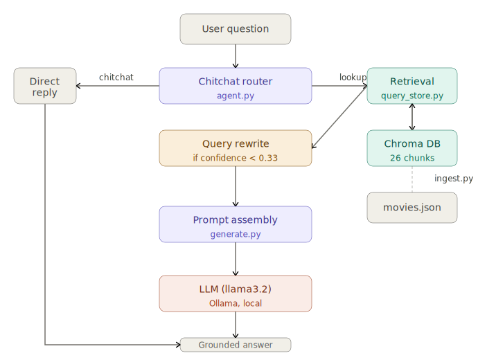

# bRAG About It

A small command-line tool that answers questions about movies — built from scratch over a week to create a Retrieval Augmented Generation (RAG) end-to-end.

## Status: Complete ✓

🟩🟩🟩🟩🟩🟩🟩 7/7 days (100%)

## Stack

| Piece | Choice | Why |
|---|---|---|
| LLM | Ollama (`llama3.2`) | Local, free, no API key needed |
| Embeddings | `sentence-transformers` (`all-MiniLM-L6-v2`) | Local, free, no rate limits |
| Vector store | Chroma | Pure Python, persists to disk |

## Architecture



The pipeline has two paths depending on what the router decides. Chitchat (greetings, meta-questions) goes straight to a direct reply with no vector search. Real questions go through retrieval, an optional query-rewrite step if confidence is low, prompt assembly, and finally the LLM. Everything is logged to `rag.log` with timestamps.

## Setup

1. Install [Ollama](https://ollama.com) and pull a model:
   ```
   ollama pull llama3.2
   ```
2. Clone the repo and install dependencies:
   ```
   git clone https://github.com/YOUR_USERNAME/bRAG_About_It.git
   cd bRAG_About_It
   python -m venv venv
   venv\Scripts\Activate.ps1   # Windows
   pip install -r requirements.txt
   ```
   First run downloads the embedding model (~80MB) from Hugging Face. Needs internet once, then it's cached locally.

3. Build the vector store:
   ```
   python code\ingest.py
   ```

## Usage

```
python code\agent.py            # interactive agent (recommended starting point)
python code\generate.py         # single-question pipeline, verbose output
python code\evaluate.py         # run the 12-question evaluation harness
python code\query_store.py      # query Chroma directly, no LLM
python code\ingest.py           # re-chunk and re-embed if you change movies.json
```

## Example session

```
Movie agent ready. Type 'quit' to exit.

You: Hi there!
Agent: Hi! I'm a movie assistant with a database of 8 films. Ask me anything about
       Inception, Shawshank Redemption, Mad Max: Fury Road, The Grand Budapest Hotel,
       Get Out, Interstellar, La La Land, or Parasite.

You: What family infiltrates a wealthy household?
Agent: The Kim family.

You: Who are the main actors in Mad Max: Fury Road?
Agent: I don't have enough information in my corpus to answer that.
```

## Evaluation results

| Metric | Score | Notes |
|---|---|---|
| Retrieval recall@3 | 10/11 = **91%** | 1 miss: short generic query for Get Out |
| Refusal detection | **100%** | Caught by code (string match), not by the LLM judge |
| GROUNDED/UNGROUNDED | **unreliable** | `llama3.2` too small for consistent faithfulness scoring |


## What I'd improve with more time

- **Hybrid search** — combine Chroma's metadata filtering with vector similarity so genre, year, and other structured fields are actually searchable, not invisible to retrieval. The current setup stores year/genre as metadata but never embeds them, so queries like "horror movies" can't filter by genre at all.
- **Larger embedding model** — swap `all-MiniLM-L6-v2` for `all-mpnet-base-v2` and rerun the Day 5 eval to measure the recall improvement on short queries.
- **Better faithfulness judge** — replace `llama3.2` as judge with a larger model or a rule-based checker. The current judge is unreliable for the GROUNDED/UNGROUNDED distinction and even returns misspelled labels on some runs.
- **Pluggable LLM backend** — let someone clone this repo and use their own Claude or Gemini API key instead of Ollama, via an env variable and a small provider wrapper.

---

## Progress log

### Day 1 — Project setup + first LLM call

Repo set up, Ollama running locally, first script-generated LLM response working.

<details>
<summary>Full notes</summary>

Set up the GitHub repo, virtual environment, and `.gitignore`. Installed Ollama on Windows, pulled `llama3.2`, and wrote a minimal script that sends a prompt and prints the response. Hit the usual first-time Windows hiccup where PowerShell blocked the venv activation script — fixed with `Set-ExecutionPolicy -Scope CurrentUser RemoteSigned`.

Also set up the `.env` / `.env.example` pattern for API key safety, even though Ollama doesn't need one, since most real projects eventually touch at least one key.

</details>

---

### Day 2 — Embeddings + semantic search

Built semantic search over 8 movie descriptions. The key finding was how unstable short queries are — two words can flip the top result entirely.

<details>
<summary>Full notes</summary>

Installed `sentence-transformers` and used `all-MiniLM-L6-v2` to embed a hand-built movie corpus, then computed cosine similarity manually against query vectors.

The most interesting finding wasn't getting it to work — it was how much query length matters. Rewording "Saves Humanity" to "A person saves the future" flipped Interstellar from the top result (0.296) to nearly last (0.173), even though the meaning is identical. With only 2 words, each individual word carries a disproportionate share of the resulting vector, so small wording changes cause big ranking swings. Longer, more descriptive queries were dramatically more consistent: "space exploration to save humanity" scored Interstellar at 0.544 with the next result under 0.16 — a clean, confident match.

Also confirmed the "real test" from the plan: querying "Two young performers in California chase their career ambitions and develop a romance" returned La La Land at 0.589 despite sharing almost no vocabulary with the actual synopsis. That gap between zero word overlap and a correct top result is what semantic search is for.

Model used: `all-MiniLM-L6-v2` (384-dimensional embeddings, ~80MB). The narrow score range (most results clustering between 0.0–0.5 rather than spanning 0–1) is a known characteristic of small embedding models — the ranking is still meaningful, but the absolute numbers aren't confidence scores.

</details>

---

### Day 3 — Chunking + persisted vector store

Moved from a flat Python list to a real Chroma database that persists between runs. 8 movies → 26 chunks stored on disk.

<details>
<summary>Full notes</summary>

Expanded each movie from a one-line description to a full synopsis paragraph, then built a chunking function: 300 characters per chunk, ~15% overlap between consecutive chunks. The overlap doesn't link chunks together — it copies the tail of one chunk to the head of the next, so a sentence that falls on a boundary still appears complete in at least one of the two chunks.

Stored everything in a Chroma `PersistentClient` collection with metadata attached to each chunk: source title, chunk index, year, genre. Year and genre aren't embedded — they ride along as metadata for filtering, not for similarity matching. That decision came back to matter on Days 5 and 6.

Hit a path bug on the first run: PyCharm's default working directory is the script's own folder (`code/`), not the project root. Fixed by computing all paths off `Path(__file__).resolve().parent.parent` so every script finds its files regardless of where it's launched from.

Some results from manual testing:
- *"Max Rockatansky finds himself captured by the War Boys"* → Mad Max chunk 0 at 0.733.
- *"I want to watch a movie where actress works as barista!"* → La La Land top at 0.417 despite casual phrasing.
- *"Yo! I want to watch a movie about a banker!"* → Grand Budapest narrowly beat Shawshank (0.336 vs 0.319) even though "banker" appears verbatim in Shawshank's synopsis. The model matches on overall plot vibe, not keyword presence.

</details>

---

### Day 4 — Retrieval + generation + prompt engineering

Closed the loop into a full RAG pipeline. Found that a grounding instruction meaningfully reduces hallucination but doesn't eliminate it — especially when the model is confident it already knows the answer.

<details>
<summary>Full notes</summary>

Wired the full path: `retrieve` → `build_prompt` → call Ollama → print answer. The prompt template uses `.format()` rather than an f-string because `context` and `question` don't exist at the time the template is defined — they're substituted later inside `build_prompt()` when a real question comes in.

Ran the grounded vs naive comparison. The naive version produced the cleanest hallucination of the week: asked "Do you know any movie about a barista?", it had La La Land's synopsis sitting right there in the context and never mentioned it. Instead it invented a movie called "Barista" (2023) with a fabricated director.

The grounded version went 7 for 7 on a first pass — until one more test. Mad Max's synopsis uses only character names, never actor names. Asked who the main actors are with the correct synopsis retrieved and the grounding instruction active, the model answered with a full five-person cast list anyway. All factually accurate, none of it in the context. The instruction was bypassed because the model was confident in its own training data.

Takeaway: a grounding instruction is a strong nudge, not a hard guarantee. It breaks down specifically when the right document is retrieved but the one specific fact being asked about isn't in it.

</details>

---

### Day 5 — Evaluation

Built a 12-question harness with separate retrieval (recall@3) and generation (faithfulness) scores. Retrieval works well. The automated judge turned into a whole investigation of its own.

<details>
<summary>Full notes</summary>

Built `evaluate.py` with a 12-question test set drawn from real findings across Days 2–4. Each question has an `expected_source` (which movie's chunk should be retrieved) and an `answerable` flag (whether the corpus actually contains the specific fact, not just the right document).

**Retrieval recall@3: 91% (10/11)** — solid. The one miss (Get Out's year) is consistent with the Day 2 finding: short, generic queries don't give the embedding enough signal.

The generation scoring went through three iterations. The first had a substring bug: `"GROUNDED"` is a substring of `"UNGROUNDED"`, so the label check matched the wrong one first and every verdict came back GROUNDED. Fixed by reordering to check `"UNGROUNDED"` first.

Even after fixing that, the LLM judge kept misclassifying refusals — returning GROUNDED on clear "I don't have enough information" answers, and even returning misspelled labels like "UNGROUNDENED." That indicated `llama3.2` is too small to reliably follow strict classification instructions.

Final approach: refusal detection moved entirely into code (simple string match — reliable, since the phrasing is consistent), LLM judge used only for the harder GROUNDED vs UNGROUNDED distinction. The judge is still flagged as unreliable for that half. In production, this would need a larger model or a rule-based approach.

The broader lesson: evaluation itself is a hard problem, and the tool used to measure quality has its own quality problem.

</details>

---

### Day 6 — Agent behavior + workflow design

Replaced the fixed pipeline with one that makes two runtime decisions: skip retrieval for chitchat, and rewrite weak queries before retrying. Added structured logging to every decision step. Discovered a fundamental metadata vs embedding gap in the process.

<details>
<summary>Full notes</summary>

Built `agent.py` as an interactive loop with two agent decisions layered on top of the existing retrieve-generate pipeline:

**Decision 1 — chitchat router.** Before any retrieval, the model classifies whether the question needs a database lookup or is just conversation. "Hi!", "What movies do you know about?", and "Thanks for your help" all correctly routed to CHITCHAT — no vector search triggered.

**Decision 2 — query rewriting on low confidence.** If the top retrieved chunk scores below 0.35, the model rewrites the query into something more descriptive before retrying. The rewrite only replaces the original if it actually improves the score.

Added structured logging via Python's `logging` module to both console and `rag.log`.

The clearest demonstration that rewriting works when it *can* work: querying "Machete!" — a one-word title for a movie not in the corpus at all — scored 0.206, triggered the rewrite, and the model expanded it to *"Action films about a lone hero seeking revenge after being betrayed by corrupt government officials or Mexican cartel members."* Score jumped to 0.365. The mechanism is sound — the limitation is what's actually stored.

The underlying reason - some rewrites still fail: genre labels (Horror), release years (2017), and director names are stored only in Chroma metadata — they were never embedded into any chunk text. Vector search is blind to them entirely. The fix in production would be hybrid search: use metadata filters (`where={"genre": "Horror"}`) to narrow the candidate set first, then run vector similarity within that subset.

</details>

---

### Day 7 — Polish + ship

Code cleaned up, README completed, architecture diagram added, release tagged.

<details>
<summary>Full notes</summary>

Went through each script removing leftover debug prints, confirming the pathlib path pattern is used consistently everywhere, and verifying nothing sensitive is tracked by git. Added `rag.log` and `chroma_db/` to `.gitignore`.

Added the architecture diagram to `docs/architecture.svg` — shows both the chitchat and lookup paths through the agent, where Chroma and the LLM sit, and which script owns each step.

The biggest reflection after the week: the most useful findings weren't the things that worked — they were the ones that broke in instructive ways. The naive hallucination (Day 4), the grounding instruction failing on confident model knowledge (Day 4), the judge misclassifying its own outputs (Day 5), and the metadata gap that no amount of query rewriting could overcome (Day 6) are all things worth understanding before building any RAG system at scale.

</details>